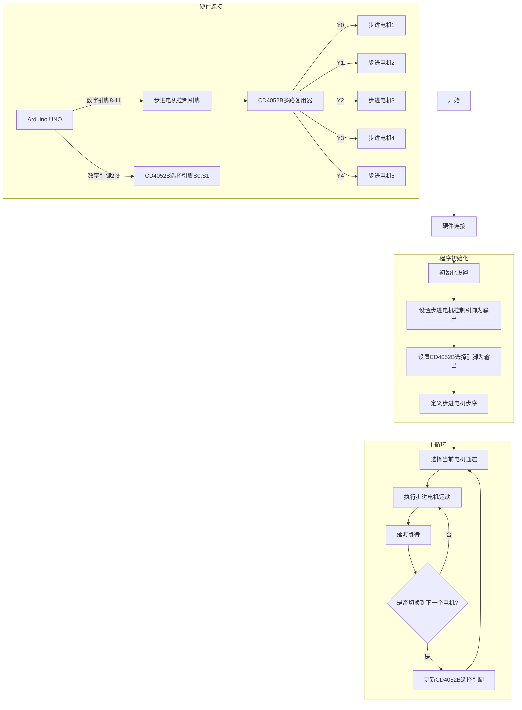

## Arduino UNO + CD4052B控制5个步进电机的接线说明

### 1. 材料清单
- 1个Arduino UNO开发板
- 1个CD4052B多路复用器
- 5个步进电机
- 1个面包板
- 连接导线
- 适配的电源供应

### 2. 接线步骤

1. Arduino UNO连接：
   - 数字引脚8-11：用于控制步进电机的四相信号
   - 数字引脚2：连接到CD4052B的S0选择引脚
   - 数字引脚3：连接到CD4052B的S1选择引脚
   - GND：接地
   - 5V：提供逻辑电平电源

2. CD4052B连接：
   - VDD(引脚16)：连接到Arduino 5V
   - VSS(引脚8)：连接到Arduino GND
   - VEE(引脚7)：连接到Arduino GND
   - INH(引脚6)：连接到Arduino GND
   - S0(引脚10)：连接到Arduino D2
   - S1(引脚9)：连接到Arduino D3
   
3. 步进电机连接：
   - 电机1：连接到CD4052B的Y0通道
   - 电机2：连接到CD4052B的Y1通道
   - 电机3：连接到CD4052B的Y2通道
   - 电机4：连接到CD4052B的Y3通道
   - 电机5：连接到X0通道（利用CD4052B的X通道）

### 3. 注意事项

1. 确保电源供应充足，步进电机可能需要独立的电源
2. CD4052B的控制信号要使用适当的逻辑电平（5V）
3. 检查所有接地连接是否正确
4. 在连接步进电机时注意相序正确
5. 建议使用去耦电容防止干扰

### 4. 通道选择逻辑

CD4052B的选择引脚（S0,S1）组合：
- 00：选择Y0/电机1
- 01：选择Y1/电机2
- 10：选择Y2/电机3
- 11：选择Y3/电机4
- 使用X0：电机5